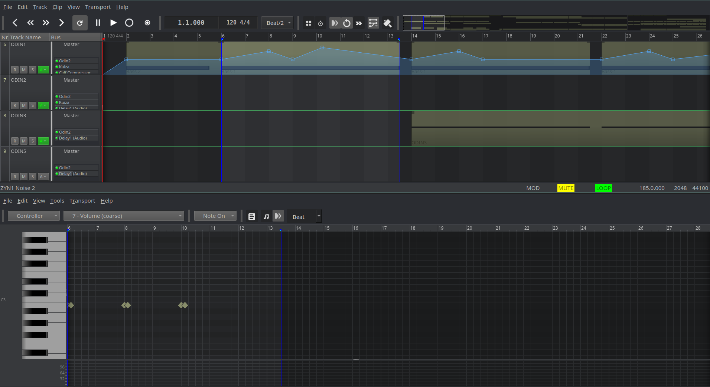
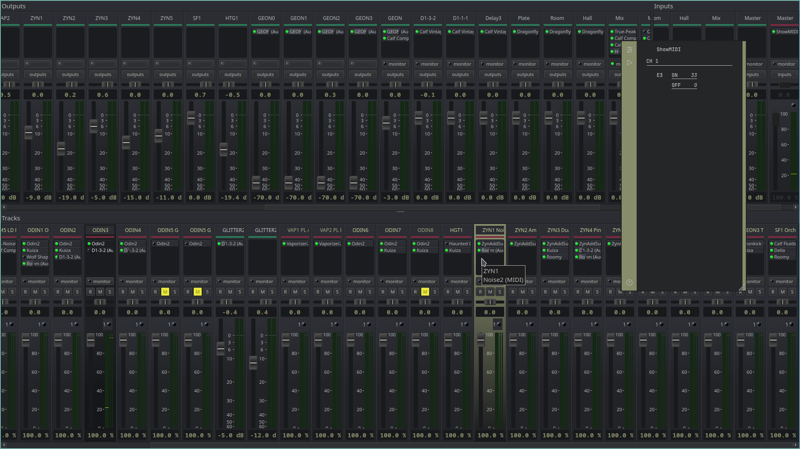

Grayscale
grayish inspired theme for [Qtractor](https://www.qtractor.org)




# Credits

Qtractor is the creation of Rui Nuno Capela (aka [rnbc](https://www.rncbc.org)).

This theme was inspired by the [incredible work](https://sourceforge.net/projects/visualthemes-qtractor/) of G3N-es.

Free software icons from [iconduck](https://iconduck.com/sets/lightning-design-icons/styles/monotone). Brightness has been reduced -30.

# Features

Everything in this design is geared toward functionality:

- By leveraging highly efficient keybindings for the most common operations, we can eliminate clutter from the interface like scrollbars, zoom buttons, and redundant or seldom used toolbars.

- A minimal set of colors are used in order to keep the focus on the data itself rather than the interface.
- Only icons providing value on their own have been maintained.

# Installation

Given the need to overwrite images, we will compile. This assumes you are running some Debian-like distro. The following steps have been verified on Ubuntu 23.10:

```
  sudo apt-get build-dep qtractor
  cd
  mkdir src
  cd src
  git clone https://github.com/windowsrefund/grayscale-theme.git
  git clone --recursive https://github.com/rncbc/qtractor.git
  cp grayscale-theme/images/\*.png qtractor/src/images
  cd qtractor
  cmake -B build
  cmake --build build -j $(($(nproc) - 1))
  sudo cmake --install build
```

# Additional Color Setup

With Qtractor running, navigate to _View > Options > Display_.

Import the _Grayscale.conf_ file obtained from this repo in order to change the color theme.

Next, import the _Grayscale.qss_ file obtained from this repo in order to change the style sheet.

The suggested colors to set in _View > Options > Display > Meters_ are _#75b5aa_ for Audio and _#555555_ for MIDI.

The suggested colors to use when creating tracks are _#252628_ for foreground and _#878C6A_ for background.

The suggested color to use for automation is _#75b5aa_.

# Toolbar Configuration

In order to reduce clutter, it is highly recommended to disable all status bars and most toolbars. In the main window, navigate to _View > Toolbars_ and disable the following:

- File
- Edit
- Track
- View

In the MIDI clip editor (piano roll), navigate to _View > Toolbars_ and disable the following:

- File
- Edit
- Transport
- Time
- Scale

Uncheck _View > Statusbar_ in both windows.

# Key Bindings

Disclaimer: I use a tiling window manager which handles some areas of my DAW-related work flow. That said, the following bindings are specific to Qtractor itself and I'd have to imagine the approach offered would benefit anyone regardless of their particular approach to window management.

All keybindings listed below are purposefully intended to be used with one hand (left in this case) resting on the home keys. This is the secret sauce to being highly productive when using an application that does justify continuous usage of the rodent. When we bind our most common operations to the hand not driving the mouse, we can avoid moving the other hand back and forth. In general, one hand (mostly) navigates and the other (mostly) operates. The focus is on streamlining the stuff we do every day. We can use the menu system for the infrequently used operations as we are not trying to bind to every possible scenario. As usage patterns become more common, we'll consider extending our bindings accordingly.

Also worth mentioning is the fact I only work with _Select Mode_ set to _clip_. In fact, I see no reason to ever work in any other mode aside from the occasional toggle to _Automation_ mode (and then back). This explains the _A_ and _Shift-A_ bindings shown below.

Keybindings in Qtractor are maintained in two distinct work areas; the main window and the MIDI clip editor. This means a given binding may exist in both while performing completely different operations. This is perfect and we do thank Rui for this brilliant design!

Although many reasonable defaults are provided "out of the box", I have personally chosen to just delete them and suggest you do the same. In other words, only bind what you intend to actually use.

Here are the suggested bindings for the main window

| Menu/Action               | Binding | Mnemonic or additional notes                                                   |
| :------------------------ | :-----: | :----------------------------------------------------------------------------- |
| clipLoopSetAction         |    R    | Repeat                                                                         |
| clipMergeAction           |    G    | Group                                                                          |
| clipSplitAction           |    S    | Split                                                                          |
| clipUnlinkAction          |    T    | Tear (not really but I just thought of it)                                     |
| editCopyAction            |    C    | Copy                                                                           |
| editDeleteAction          |    D    | Delete                                                                         |
| editPasteAction           |    V    | Paste                                                                          |
| editRedoAction            | Shift-Z | Opposite of Z                                                                  |
| editSelectModeClipAction  | Shift+A | Opposite of A                                                                  |
| editSelectModeCurveAction |    A    | Automation                                                                     |
| editUndoAction            |    Z    | Undo                                                                           |
| fileCloseAction           |    X    | Heavily used binding most often used to close Piano Roll window                |
| transportBackwardAction   |    B    | Heavily used to navigate back across the timeline to a given marker or head    |
| transportForwardAction    |    F    | Heavily used to navigate forward across the timeline to a given marker or head |
| transportLoopSetAction    | Shift+R | Set Loop range after moving Loop-start and/or Loop-end marker(s)               |
| transportPlayAction       |  Space  |                                                                                |
| viewMenubarAction         | Ctrl+M  | Keep this around just in case the Menu Bar is accidently closed!               |
| viewSnapPerBeat1          |    1    | Quarter note                                                                   |
| viewSnapPerBeat2          |    2    | 8th note                                                                       |
| viewSnapPerBeat3          |    3    | 8th note triplet                                                               |
| viewSnapPerBeat4          |    4    | 16th                                                                           |

Here are the suggested bindings for the MIDI Clip Editor (Piano Roll) window

| Menu/Action             | Binding | Mnemonic or additional notes                      |
| :---------------------- | :-----: | :------------------------------------------------ |
| editCopyAction          |    C    | Copy                                              |
| editDeleteAction        |    D    | Delete                                            |
| editModeDrawAction      | Shift+W | Seldom used. Think of it as a "Special write"     |
| editModeOffAction       |    S    | Select                                            |
| editModeOnAction        |    W    | Write                                             |
| editPasteAction         |    V    | Paste                                             |
| editRedoAction          | Shift-Z | Opposite of Z                                     |
| editSelectAllAction     |    A    | All                                               |
| editSelectInvertAction  | Shift-S | Think of it as "opposite of selected"             |
| editSelectNoneAction    | Shift+A | Opposite of A                                     |
| editUndoAction          |    Z    | Undo                                              |
| fileCloseAction         |    X    | Heavily used                                      |
| toolsQuantizeAction     |    Q    | Quantize                                          |
| toolsTransposeAction    |    T    | Transpose                                         |
| transportBackwardAction |    B    | Back                                              |
| transportForwardAction  |    F    | Forward                                           |
| transportPlayAction     |  Space  |                                                   |
| viewEventsAction        |    E    | Event Viewer                                      |
| viewMenubarAction       | Ctrl+M  | Keep this around to reveal the menu bar if needed |
| viewSnapPerBeat1        |    1    | Quarter Note                                      |
| viewSnapPerBeat2        |    2    | 8th note                                          |
| viewSnapPerBeat3        |    3    | 8th note triplet                                  |
| viewSnapPerBeat4        |    4    | 16th note                                         |
| viewZoomResetAction     | Shift+R | Reset zoom                                        |

# The Perfect i3 Configuration

In the event you are using i3, here are the bits of my configuration:

```
# Qtractor (order matters here)
# first, we set everything to float
for_window [class="(?i)Qtractor"] floating enable

# Now we override that behavior for only specific windows
for_window [class="(?i)Qtractor" title="Track [0-9]*\)"] floating disable, layout splitv
for_window [class="(?i)Qtractor" title="Mixer"] floating disable, border none
for_window [class="(?i)Qtractor" title="Connections"] floating disable, layout splith
# This is the default startup when not using a template
for_window [class="(?i)Qtractor" title="Untitled1"] floating disable
# When we open a saved session
for_window [class="(?i)Qtractor" title="\.qtr"] floating disable

# DAW on the left, mixer on the right
assign [class="(?i)Qtractor" title="Mixer"] $ws4
assign [class="(?i)Qtractor"] $ws3
```

# Extras

- _ShowMIDI-grayscale.svg_ theme file for the very cool [ShowMIDI](https://github.com/gbevin/ShowMIDI) plugin.
