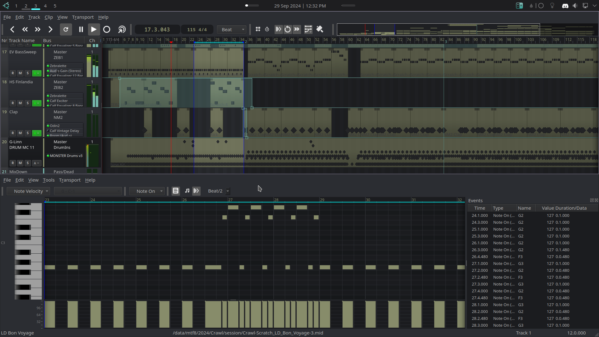

## Grayscale

A grayish inspired theme for [Qtractor](https://www.qtractor.org)




### Credits

- Qtractor is the creation of Rui Nuno Capela (aka [rnbc](https://www.rncbc.org)).
- This theme was inspired by the [incredible work](https://sourceforge.net/projects/visualthemes-qtractor/) of G3N-es.
- Free software icons from [iconduck](https://iconduck.com/sets/lightning-design-icons/styles/monotone)

### Features

Everything in this design is geared toward functionality:

- By leveraging highly efficient keybindings for the most common operations, we can eliminate clutter from the interface like scrollbars, zoom buttons, and redundant or seldom used toolbars.
- A minimal set of colors are used in order to keep the focus on the data itself rather than the interface.
- Only icons providing value on their own have been maintained.

### Installation

Given the need to overwrite images, we will compile. This assumes you are running some Debian-like distro. The following steps have been verified on Ubuntu 23.10:

```
sudo apt-get build-dep qtractor
cd
mkdir src
cd src
git clone https://github.com/windowsrefund/grayscale-theme.git
git clone --recursive https://github.com/rncbc/qtractor.git
cp grayscale-theme/images/*.png qtractor/src/images
cd qtractor
cmake -B build
cmake --build build
sudo cmake --install build
```

### Configuration

With Qtractor running, navigate to View > Options > Display. Import the Grayscale.conf file obtained from this repo in order to change the color theme.

Next, import the Grayscale.qss file obtained from this repo in order to change the style sheet.

The suggested colors to set in View > Options > Display > Meters:

- Audio is <span style='color: #2a7c5b;'>#2a7c5b</span>
- MIDI is <span style='color: #7c2a40;'>#7c2a40</span>

The suggested colors to use when creating tracks:

- Foreground is <span style='color: #252628;'>#252628</span>
- Background is <span style='color: #878c6a;'>#878C6A</span>

The suggested color to use for automation is <span style='color: #bdbdbd;'>#bdbdbd</span>

Optimize the main window:

Disable the following toolbars using View > Toolbars

- File
- Edit
- Track
- View

Optimize the MIDI clip editor:

Disable the following toolbars using View > Toolbars

- File
- Edit
- Transport
- Time
- Scale

### Key Bindings

All keybindings are left hand only. This is the secret sauce to being highly productive when using an application that does call for mouse usage. When we bind our most common operations to the left hand (or right depending on which hand you hold your mouse with), we can avoid moving the other hand back and forth between the mouse and keyboard (over and over again). The mouse becomes primarily used to navigate while the other hand is used primarily to "do things". Again, the focus is on the stuff we do every day. We're not trying to capture every possible scenario. As patterns become more common, we'll consider extending our mappings as needed...

Coming soon.
